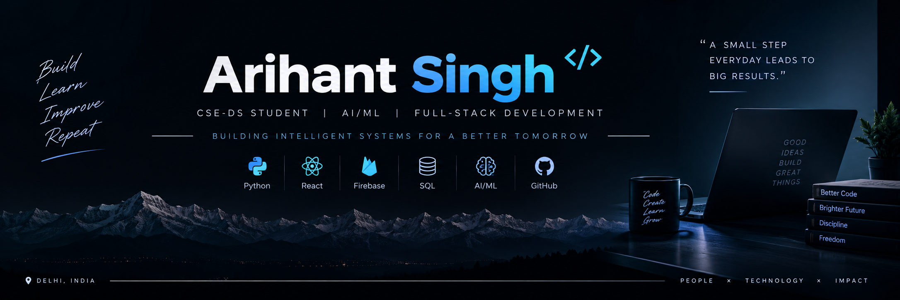

# Hi, I'm Arihant Singh 👋

### CSE-DS Student | AI/ML & Full-Stack Developer

I'm a Computer Science student specializing in Data Science, passionate about building practical software, AI-powered applications, and intelligent systems that solve real-world problems.

## 🚀 What I'm Building

- 🤖 AI & Machine Learning applications
- 🌐 Full-Stack web applications
- 📊 Data-driven solutions
- 🧠 Intelligent systems & automation
- 🏆 Hackathon projects

## 🛠️ Tech Stack

**Languages**
- Python
- C++
- Java
- JavaScript

**Technologies**
- React
- Firebase
- Streamlit
- Git & GitHub
- AI/ML

## 💻 Tech & Tools

## 🌱 Currently Learning

- 🤖 Advanced AI & Machine Learning
- 📊 Data Science & Data Analytics
- 🧠 Generative AI & AI Agents
- ☁️ Cloud & Backend Development
- 🚀 Building and deploying real-world AI applications

## ⭐ Featured Projects

### 🚆 TramenAI
AI-powered railway traffic control and scheduling system designed to optimize train operations, detect conflicts, and improve network efficiency.

[GitHub](https://github.com/Arihantdev/TramenAI) • [Live Demo](https://tramenai.netlify.app/) • [Release v1.0.0](https://github.com/Arihantdev/TramenAI/releases/tag/v1.0.0)

### 🧠 Second Mind
AI-powered personal knowledge management system designed to organize, connect, and interact with information intelligently.

[GitHub](https://github.com/Arihantdev/SecondMind) · [Live Demo](https://secondmindai.netlify.app/)

### 🏃 AthleteGuard
AI-powered application focused on athlete safety and intelligent monitoring.

[GitHub](https://github.com/Arihantdev/AthleteGuard) • [Live Demo](https://athleteguard-yhff3olxhgymhwm2skmj2r.streamlit.app/)

## 📫 Connect With Me

- 💼 [LinkedIn](https://www.linkedin.com/in/arihant-singh-4a07ab428/)
- 💻 [GitHub](https://github.com/Arihantdev)
